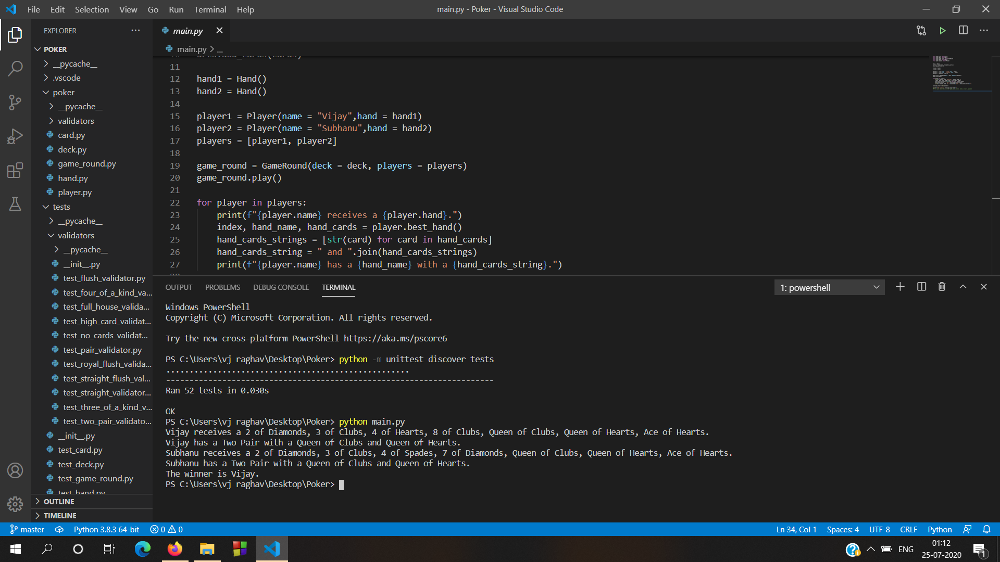
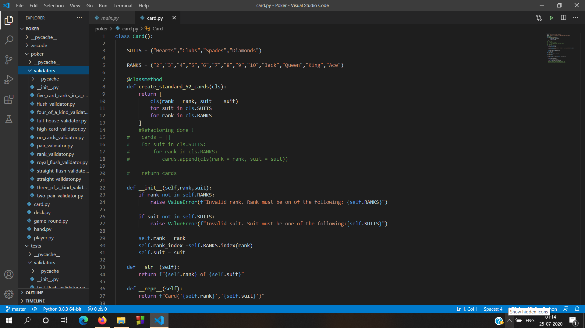
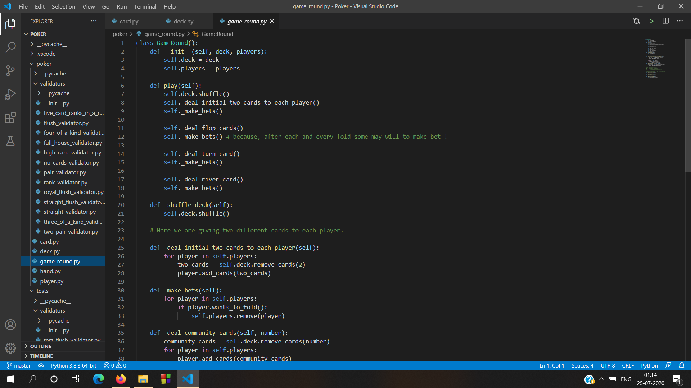

# Poker
This is Poker Game, which is fully done with plain Python. This is implemented with Test Driven Development method. I studied Python &amp; Test Driven Method and implemented this. This has all logics of Poker Game. But i didn't include Betting system. If any interested to include those, you are most welcome !

   
  <i>Ran 52 Tests Successfully !</i>

Youtube Link-https://youtu.be/sHnCJb1ARq0

   
  <i>List of Cards in the deck !</i>

   
  <i>Game Initiating file !</i>

## Status of the Project

#### What Works
 
* Players can be declared in the main.py file
* Initial Cards, Communnity cards - Flop cards, Turn card, River card will be automatically fetched from the deck using random shuffle module.
* I created 10 validators in 10 python file, and called by importing it from the __init__.py file
* Winners is calculated by who is having the best combination of cards.

This created with Python !

####  Future Work

* Anyone can branch out and make it more interactive and send me pull request
